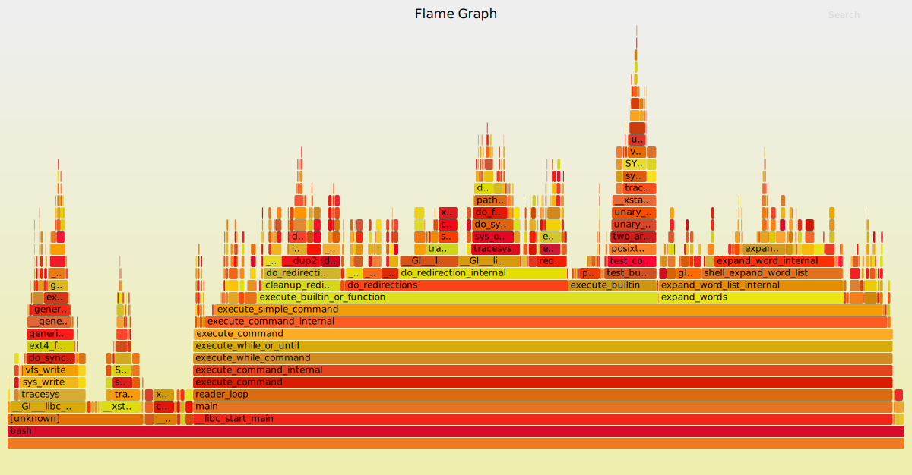
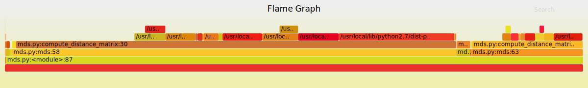
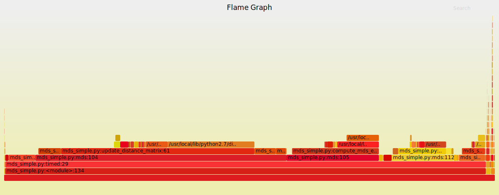

# Real world Python performance tuning
A tutorial for optimizing CPU bound applications in python

## Introduction  

In this tutorial we will present a simple way to optimize CPU bound python programs. CPU bound applications are defined as applications whose runtime performance is mainly dominated by the number of CPU cycles for the program operations in contrast to memory or I/O bound applications for which the CPU is mainly idle. Such applications include numerical computing algorithms, feature extraction modules etc.

The goal of this tutorial is not to achieve the absolutely best performance, but to showcase that Python modules can become viable enough for such tasks and avoid rewrites in lower level languages (e.g. C/C++).

What we will cover:

1. Python profiling using [flame graphs](http://www.brendangregg.com/flamegraphs.html)  
2. Vectorization of operations to take full advantage of NumPy's performance  
3. Implementing slow functions in Cython  

As a working example we will study parts and optimize parts of a suboptimal implementation of the Multidimensional scaling algorithm. The initial implementation takes about 90 seconds to run in a predefined configuration that we will use as a benchmark.

To get a sense of the effectiveness of this techniques, initial benchmarks show ~30x-40x speedup in execution time.

## Flame Graphs

The first step when optimizating an application is profiling. By profiling we can focus on parts of the code that are more time consuming and focus on them to get maximum performance gains by spending minimum effort. There are many profiling tools for Python (cProfile, PyCharm's integrated profiler etc.) but I recommend using Flame Graphs, which are a visual and intuitive profiling tool. Note that Flame Graphs are not specific to python, but can be also be used for C/C++, Java, node.js etc.

To this purpose we can use [Uber's pyflame](https://github.com/uber/pyflame). Pyflame is fast, simple to use and can generate flamegraph parseable profiling data. 

Flame Graphs are a visualization for sampled stack traces, which allows hot code-paths to be identified quickly. Here's an example. Github markdown doesn't allow full rendering of SVGs for security purposes, but if you clone the repo and open the SVGs in your browser the boxes should be clickable and you should be able to zoom in/out:



Let's inspect the visualization and try to make sense of it.

1. Each box represents a function in the stack  
2. If a box (f1) is on top of another (f2) it means that f2 calls f1  
3. It follows that on the vertical axis we can see the program's call stack  
4. The width of a box shows the time it was on-CPU  

TL;DR: Find the wider boxes that correspond to our code and optimize them first.  

You can create a flamegraph for an python program by
1. installing pyflame and FlameGraph:  
```bash
# install pyflame
apt-get install autoconf automake autotools-dev g++ pkg-config python-dev python3-dev libtool make
git clone https://github.com/uber/pyflame
cd pyflame
./autogen.sh
./configure
make
make install

# install flamegraph
git clone https://github.com/brendangregg/FlameGraph ~/FlameGraph
```
2. running the profiler:  
```bash
pyflame -s 10 -r 0.01 -o perf.data -t python my_script.py
```
3. generating and inspecting the svg:
```bash
~/FlameGraph/flamegraph.pl perf.data > perf.svg
firefox perf.svg
```

Here's the flamegraph for our starting implementation of the MDS algorithm. Note that the boxes don't only correspond to the function in the stack, but also to the line of code inside the function which gives us even more fine grained information: 


## Vectorizing operations with NumPy  

We can see from the above image that over 90% of the program runtime is spent in function called `compute_distance_matrix`:

Let's take a look at the code:
```python
def compute_distance_matrix(Xs,D_current=None,i=None):
    if i is None:
        D_current = np.zeros((Xs.shape[0],Xs.shape[0]))
            for k in range(len(Xs)):
                for l in range(len(Xs)):
                    D_current[k,l] = np.linalg.norm(Xs[k]-Xs[l],2)
    else:
        for k in range(len(Xs)):
            D_current[k,i]=D_current[i,k] = np.linalg.norm(Xs[k]-Xs[i],2)
    return D_current
```

This function essentially computes the distance of each point (row) in `Xs` from a specified row `Xs[i]` and modifies the appropriate column/row in the `D_current` distance matrix. Notice that `D_current` is symmetric.

It is well documented that NumPy operations don't have optimal performance when used in for loops. Instead all operations should be vectorized as follows:

```python
# function was renamed during refactoring.
def update_distance_matrix(xs, d_current, i):
    idx = np.arange(xs.shape[0])
    norm = np.linalg.norm(xs - xs[i], ord=2, axis=1)
    d_current[idx, i] = norm
    d_current[i, idx] = norm
    return d_current
```

In the same spirit, we can rewrite the `compute_mds_error` function which is the next most intensive part of our program:

- Initial implementation  
```python
def compute_mds_error(D_goal,D_current,i=None):
    if i is None:
        return sum(sum(np.power(D_goal-D_current,2)))
    elif i<0 :
        return np.array([sum(np.power(D_goal[k]-D_current[k],2)) for k in range(len(D_goal))])
    else:
        return sum(np.power(D_goal[i]-D_current[i],2))
```

- Vectorized implementation
```python
def compute_mds_error(d_goal, d_current):
    return np.sum((d_goal - d_current) ** 2)
```

We can see that the vectorized versions are cleaner and easier to understand. By running the benchmark again we can see it takes about 6 seconds, which is a 15x performance boost by simply vectorizing 2 functions. The flame graph for the vectorized version is shown below:



## Optimizing slow functions with Cython

In the vectorized implementation flamegraph we can identify the following hotspots:

1. `numpy.linalg.norm`  
2. `compute_mds_error`  

But can we do better? The first hotspot is an off the self optimized numpy implementation for norm calculation and `compute_mds_error` cannot be vectorized any further. To proceed we must note:

1. that numpy's norm function is too general for our purposes. It surely has a lot of unneeded checks and generalizations that don't apply to our case  
2. `d` and `d_goal` are symmetric matrices, which means that compute_mds_error does two times the work it should be doing  

Enter Cython (or C for the faint if heart). Cython will allow us to write variants of these functions that have C like performance. The speed gains by rewritting slow functions in Cython are due to

1. Cython allows for type annotations, which speed up Python's type inference  
2. We don't have to write vectorized code in Cython, so we can handle all the low level optimizations (like symmetric matrices, memory access patterns)
3. Cython code is transpiled in C and then we can compile it with the `-O3` flag and let gcc do further optimizations  
4. In Cython we can do some unsafe optimizations like disabling Python's GIL for parallelization, disabling bounds check etc  
5. In Cython we can directly use functions from optimized C libraries (like libc)  

Here is the final implementation of the fast Cython variants.

- We can swap out `numpy.linalg.norm` calls with `dist_from_point`
```python
import numpy as np
cimport numpy as np
cimport cython
from cython.parallel cimport parallel, prange

# don't use np.sqrt - the sqrt function from the C standard library is much faster
from libc.math cimport sqrt


@cython.boundscheck(False)
@cython.wraparound(False)
def dist_from_point(double [:, :] x, double [:] y):
    cdef:
        Py_ssize_t nrow = x.shape[0]
        Py_ssize_t ncol = y.shape[0]
        Py_ssize_t ii = 0, jj = 0

        double s = 0, diff = 0

        np.ndarray[np.float64_t, ndim=1] d = np.zeros(nrow, np.double)

    for ii in range(nrow):
        s = 0
        for jj in range(ncol):
            diff = x[ii, jj] - y[jj]
            s += diff * diff
        s = sqrt(s)
        d[ii] = s
    return d
```

- We can swap out `compute_mds_error` with `mse`. Notice we make use of the symmetric nature of `d` & `d_goal`
```python

@cython.boundscheck(False)
@cython.wraparound(False)
def mse(double [:] d_goal, double [:] d):
    cdef:
        Py_ssize_t N = d.shape[0]
        Py_ssize_t ii = 0

        double s = 0, diff = 0

    for ii in range(N):
        diff = d_goal[ii] - d[ii]
        s += diff * diff
    return s
```

Notice: 
- We provided type annotations using Cython's builtin `cdef`
- We write C style code, but with Python syntax and conveniences (e.g. garbage collection)  

We can compile Cython by running:
```bash
cython mds_utils.pyx
gcc -Wno-cpp -shared -fno-strict-aliasing -fopenmp -ffast-math -O3 -Wall -fPIC -I/usr/include/python2.7 -I/usr/local/lib/python2.7/dist-packages/numpy/core/include/ -o mds_utils.so mds_utils.c
```

The final product runs the benchmark in about 2-3 seconds which indicates about 40x performance improvement.

In the future we want to investigate Cython's parallel module to parallelize pieces of the code.

## Conclusions

In this tutorial we showcased how flame graphs created for python applications and how to identify hotspots in an application using them. We demonstrated how an inefficient for loop based implementation can be converted to an efficient vectorized one. Finally we showed how to take the optimization process one step further by utilizing Cython.

## References

[(1) CPU Flame Graphs](http://www.brendangregg.com/FlameGraphs/cpuflamegraphs.html)  
[(2) From python to numpy](https://www.labri.fr/perso/nrougier/from-python-to-numpy/)  
[(3) Cython](http://cython.org/)
